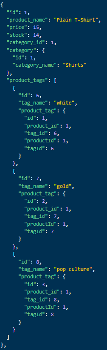
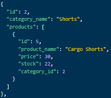
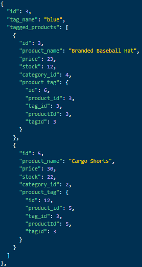

# e-commerce back end

## Table of Contents

-   [Description](#description)
-   [Installation](#installation)
-   [Usage](#usage)
-   [Walkthrough](#walkthrough)
-   [License](#license)
-   [Contributing](#contributing)
-   [Questions](#questions)

## Description

As a University of Washington Coding Boot Camp student, I would like to become more aquainted with back end development. This project is an ecommerce database management app that uses api requests to view, create, update, and delete product, category, and tag data inside a SQL database. This app utilizes Sequelize to form easy-to-use models and create queries directly in the code, and Express.JS to handle the server connection and routes.

## Installation

Dependencies:

-   dotenv
-   express
-   mysql2
-   sequelize

To install, run `npm i` in the root directory.

## Usage

Replace the `.env.EXAMPLE` data with your own database information and rename the file to `.env`. After installing the necessary packages, open mysql and run `source schema.sql` in the `db` directory to create the database. Start the server by navigating back to the root directory and running the command `npm start`. This will create all the tables based on the Sequelize models in the `models` directory. To seed the database with data for testing, run `npm run seed`.

### API routes

All routes below go through `/api/`.

`/products`

-   `/`

    -   <strong>GET</strong>: returns a JSON object with every Product in the database, with associated Tag and Category information.

    -   <strong>POST</strong>: creates a Product with the information provided in the `body` of the request and returns it as a JSON object.

-   `/:id`

    -   <strong>GET</strong>: returns a JSON object containing the Product with the specified `id`, including its Tag and Category information.

    -   <strong>PUT</strong>: updates the Product with the specified `id` based on the information provided in the `body` of the request.

    -   <strong>DELETE</strong>: permanently removes the Product with the specified `id` from the database.

-   Body format required for <strong>POST</strong> and <strong>PUT</strong>:
    `{
    product_name: "Basketball",
    price: 200.00,
    stock: 3,
    tagIds: [1, 2, 3, 4]
}`

-   Example response for a call to `/api/products/1`:

    

`/categories`

-   `/`

    -   <strong>GET</strong>: returns a JSON object with every Category in the database, each with its associated Products.

    -   <strong>POST</strong>: creates a Category with the information provided in the `body` of the request and returns it as a JSON object.

-   `/:id`

    -   <strong>GET</strong>: returns a JSON object containing the Category with the specified `id`, including its associated Products.

    -   <strong>PUT</strong>: updates the Category with the specified `id` based on the information provided in the `body` of the request.

    -   <strong>DELETE</strong>: permanently removes the Category with the specified `id` from the database. IMPORTANT: all associated Products must be updated or deleted <i>prior</i> to deleting the Category.

-   Body format required for <strong>POST</strong> and <strong>PUT</strong>:
    `{
  "category_name": "Socks"
}`

-   Example response for a call to `/api/categories/2`:

    

`/tags`

-   `/`

    -   <strong>GET</strong>: returns a JSON object with every Tag in the database, each one including a list of all of the Products with that Tag.

    -   <strong>POST</strong>: creates a Tag with the information provided in the `body` of the request and returns it as a JSON object.

-   `/:id`

    -   <strong>GET</strong>: returns a JSON object containing the Tag with the specified `id`, including a list of all the Products with that Tag.

    -   <strong>PUT</strong>: updates the Tag with the specified `id` based on the information provided in the `body` of the request.

    -   <strong>DELETE</strong>: permanently removes the Tag with the specified `id` from the database. Any Products referencing this Tag will simply have it removed from their list.

-   Body format required for <strong>POST</strong> and <strong>PUT</strong>:
    `{
  "tag_name": "yellow"
}`

-   Example response for a call to `/api/tags/3`:

    

## Walkthrough

<a href="https://drive.google.com/file/d/1SRJnwu2BRtpUTlf45l_GLENAc_WJBEsy/view">https://drive.google.com/file/d/1SRJnwu2BRtpUTlf45l_GLENAc_WJBEsy/view</a>

## License

Please refer to the LICENSE in the repo.

## Contributing

N/A

## Questions

Github profile: <a href="https://github.com/vlad-kronk">vlad-kronk</a>

Email <a href="mailto: jacobmeyers6@outlook.com">jacobmeyers6@outlook.com</a> with any further questions.
